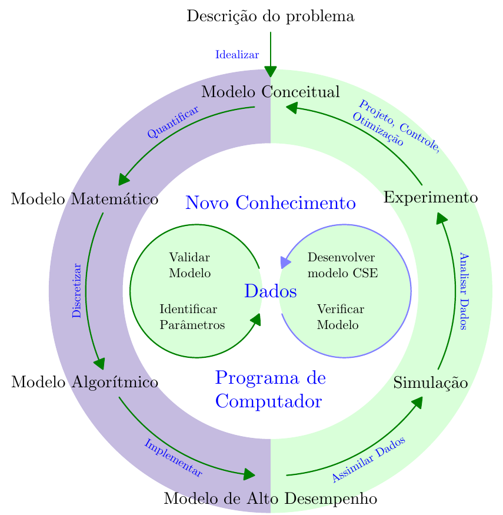

  <a href="https://github.com/pedrohnv"
     style="display:inline-flex;align-items:center;justify-content:center;
            width:80px;height:32px;margin:0 4px;
            border:1px solid #ccc;border-radius:4px;
            text-decoration:none;color:inherit;vertical-align:middle;">
    
    GitHub
  </a>
  <a href="https://orcid.org/0000-0002-3639-0851"
     style="display:inline-flex;align-items:center;justify-content:center;
            width:80px;height:32px;margin:0 4px;
            border:1px solid #ccc;border-radius:4px;
            text-decoration:none;color:inherit;vertical-align:middle;">
    
    ORCID
  </a>
  <a href="https://www.linkedin.com/in/pedro-h-n-vieira-9338a7189/"
     style="display:inline-flex;align-items:center;justify-content:center;
            width:92px;height:32px;margin:0 4px;
            border:1px solid #ccc;border-radius:4px;
            text-decoration:none;color:inherit;vertical-align:middle;">
    
    Linkedin
  </a>
  <a href="https://lattes.cnpq.br/2170578643976157"
     style="display:inline-flex;align-items:center;justify-content:center;
            width:80px;height:32px;margin:0 4px;
            border:1px solid #ccc;border-radius:4px;
            text-decoration:none;color:inherit;vertical-align:middle;">
    
    Lattes
  </a>

Um site criado com o [Quarto](https://quarto.org/) sobre Ciência e Engenharia Computacional, por Pedro Henrique Nascimento Vieira. Este site foca principalmente em Engenharia Elétrica, pois esta é a minha formação, mas espero que seja útil a pessoas de outras disciplinas também.

# Ciência e Engenharia Computacional

A Ciência e Engenharia Computacional (CSE[^CSE]) é essencial para a indústria e a academia. A metodologia da CSE, ilustrada na [@fig-cse_ciclo], baseia-se em descrever um problema conceitual, quantificá-lo por um modelo matemático, discretizá-lo segundo um modelo algorítmico, criar um programa para Computação de Alto Desempenho (HPC[^HPC]), fazer simulações e comparar os resultados com medições para validar o modelo ou projeto. Este ciclo é repetido até que os objetivos do projeto ou pesquisa tenham sido alcançados [@Rude2016Research].

[^CSE]: _Computational Science and Engineering_

[^HPC]: _High Performance Computing_

{#fig-cse_ciclo fig-alt="Diagrama em formato de ciclo que ilustra a metodologia da Ciência e Engenharia Computacional. No anel externo, partindo da ‘Descrição do problema’, o fluxo segue para Modelo Conceitual, Experimento e Simulação, retornando ao problema, com setas que indicam idealizar o problema, projetar, controlar, otimizar, analisar dados e assimilar dados. No anel interno, o mesmo ciclo é descrito em termos computacionais: Modelo Matemático, Modelo Algorítmico e Modelo de Alto Desempenho, com setas que indicam quantificar, discretizar e implementar. No centro aparecem os termos Novo Conhecimento, Dados e Programa de Computador, com dois círculos menores que destacam, de um lado, validar o modelo e identificar parâmetros, e, do outro, desenvolver o modelo CSE e verificar o modelo."}

# Referências